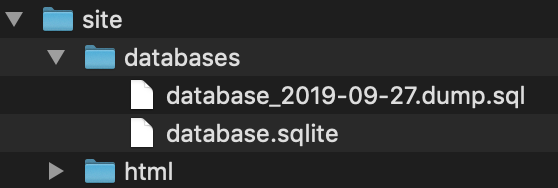
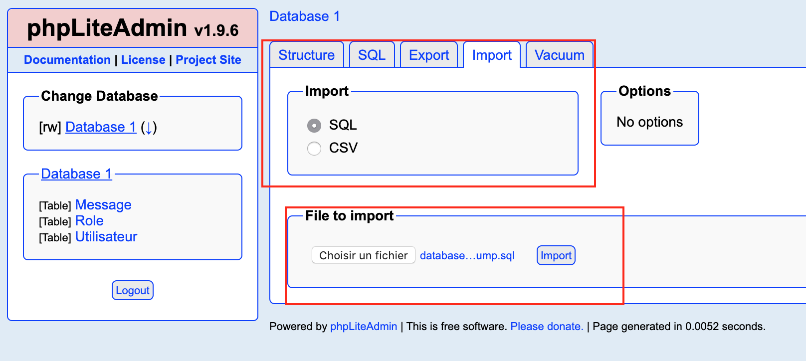

# STI-Project2

> Auteurs : Dejanovic Stefan & Benoit Julien  
> Date : 15.01.2020

## Introduction

Le but de ce projet était de faire un test de sécurité sur site web qui a été réalisé à l'aide d'une vieille version de PHP ainsi que d'une base de donnée SQLite.


## Comment lancer l'application

Afin de lancer notre application, il faut au préalable avoir Docker installé sur la machine.

L’arborescence de fichiers doit être comme sur l’image si dessous :



Il faut s’assurer que les droit sur le dossier databases et sur le fichier database.sqlite soient en lecture et écriture pour les “autres” dans le cas contraire, taper les commandes ci-dessous en se situant dans le dossier `site` :

```bash
sudo chmod o+rw databases
sudo chmod o+rw databases/database.sqlite
```

Tout ce qui concerne le site doit se trouver dans le dossier `html` et tout ce qui concerne la base de données dans le dossier `databases`. 

Pour lancer le container Docker avec le serveur nginx et PHP5, il faut aller sur le dossier principal via le terminal et lancer le script bash start.sh

```bash
./start.sh
```


3. Puis, accéder à la page d’administration de la base de données qui se trouve à l’adresse 

   - **Pour Docker toolbox avec port 8080 :**	http://192.168.99.100:8080/phpliteadmin.php
   - **Pour Docker Desktop avec port 8080 :**   http://localhost:8080/phpliteadmin.php

   **Note:** pour accéder à la console d'administration, taper "admin" pour le mot de passe

   **Note:** Si la base de donnée est déjà présente avec des donnée dedans, il n’est pas nécessaire de faire l’importation du fichier sql.

   Ensuite, il faut aller dans l'onglet "Import", sélectionner "SQL" et importer le fichier sql `database_2019-09-27.dump.sql` qui se trouve dans le dossier `site/databases/` via le bouton "Choisir un fichier" puis "Import" comme ci-dessous:

   
   
   

Les 2 utilisateurs suivants seront créés avec chacun, leur mot de passe et un rôle : 

- volkan / volkan2019 (administrateur)
- julien / julien2019 (collaborateur)

Afin d'accéder à l'application, aller dans un navigateur web et taper l'adresse suivante:

- **Pour Docker toolbox avec port 8080 :**	http://192.168.99.100:8080/ 
- **Pour Docker Desktop avec port 8080 :**	http://localhost:8080/

À ce stade, vous pouvez aisément utiliser l'application. Une fois terminé, il suffit de quitter le navigateur web et de stopper le conteneur Docker avec la commande suivante : 

```bash
docker stop sti_project
```

Il est possible de supprimer ce conteneur ensuite en faisant :

```bash
docker rm sti_project
```

